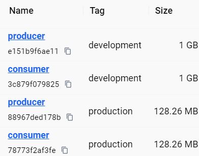
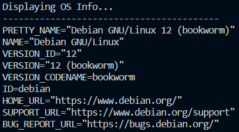

# Microservices Ping-Pong

<br />
<p align="center">
  <a href="https://github.com/jgome284/Microservices-Ping-Pong">
    
  </a>

  <h3 align="center">Foreword</h3>

  <p align="center">
    A microservices project utilizing DevOps best practices for development on Visual Studio Code.
    <br />
    <a href="https://github.com/jgome284/Microservices-Ping-Pong/issues">Report Bug</a>
    ·
    <a href="https://github.com/jgome284/Microservices-Ping-Pong/issues">Request Feature</a>
  </p>
</p>

## Table of Contents

- [Microservices Ping-Pong](#microservices-ping-pong)
  - [Table of Contents](#table-of-contents)
  - [About](#about)
  - [Prerequisites](#prerequisites)
  - [Getting started](#getting-started)
    - [Development](#development)
    - [Production](#production)
  - [License](#license)

<!-- ABOUT THE PROJECT -->
## About

[Microservices Ping-Pong](https://github.com/jgome284/Microservices-Ping-Pong)

This project serves as an example of how to setup microservices for development with Docker Compose. Compose runs services as containers. A Development Container (or Dev Container for short) is also included. It provides you a full-featured development environment for each service. Each service is defined for its intended use case with its own `devcontainer.json` file, Docker image, and requirements. DevContainers are used to run each service as its own application. They separate tools, libraries, or runtimes needed for working with a codebase, and aid in continuous integration and testing. Dev containers can be run locally or remotely, in a private or public cloud, in a variety of supporting tools and editors.

[These DevContainers](.devcontainer), are built IAW the [DevContainers specification](https://containers.dev/implementors/spec/). Each microservice is tailored for a build environment that runs on Debian-Linux with python. The DevContainers have git for version control and several extensions installed for Visual Studio Code as development utilities.

<!-- PREREQUISITES -->
## Prerequisites

To start, you need to have Docker Engine and Docker Compose on your machine. You can either:

- Install Docker Desktop which includes both Docker Engine and Docker Compose
- Install Docker Engine and Docker Compose as standalone binaries

Additionally, these DevContainers are meant to work on Visual Studio Code. You should have it installed along with the [remote development pack](https://marketplace.visualstudio.com/items?itemName=ms-vscode-remote.vscode-remote-extensionpack) to enable the IDE's DevContainers functionality.

A `config.sh` file is included in the `.devcontainer` folder to automate your git configuration settings. This script is run as a `postCreateCommand` as specified in `.devcontainer.json`. Add a credentials.txt file to the same folder location - `./.devcontainer/` - in the following format to take advantage of this functionality.

```sh
User:"YOUR NAME HERE"
Email:"your.email@here"
```

`credentials.txt` is added to .gitignore so your name and email are not tracked by git... privacy rocks! 🤘(▀̿Ĺ̯▀̿ ̿)

The microservices built have *cowsay* as a dependency for demonstration purposes. You can add additional packages to each container in their respective `requirements.txt` file. Dependencies will be handled during the build process with Docker.

<!-- GETTING STARTED -->
## Getting started

There are two `.yaml` files included for this project. `compose-dev.yaml` serves for the development configuration and `compose.yaml` is meant for the production version. The Dockerfiles created for each service are multi-stage builds. The first stage, or development stage, hosts additional tools like git. The second stage, or deployment stage is built with a *slim* OS system variant and without extra tools that are not required for a production application. Shown below are the images built and their respective sizes for comparison.



### Development

Open Docker Desktop to run the Docker daemon, a background process that manages and coordinates Docker containers on your system. On VS Code, start the development container by running `Dev Containers: Rebuild and Reopen In Container` in the command palette. It can be accessed with the keyboard shortcut `ctrl + shift + P` on your keyboard.

Since two `devcontainer.json` files are available, VS Code will ask you which service you would like to attach to. Regardless of your choice, both services are launched by Docker Compose IAW `compose-dev.yaml`.

Visual Studio will establish a remote connection to the development container you selected. Several extensions are installed in the IDE as development utilities. Of note, when a successful connection is made to the container, info for the Debian-Linux OS is displayed as shown below:



The other service's DevContainer can be opened on a seperate VS Code window in like manner. Alternatively, you can switch DevContainers by running `Dev Containers: Switch Container` on the command palette. Reference the [following article](https://code.visualstudio.com/remote/advancedcontainers/connect-multiple-containers) for detailed information on connecting to multiple containers.

With both devcontainers running, test out the application by running each service. We're playing a game of Ping-Pong 🏓 and a random character is selected for each match! User input is required and you'll need to make the right serve if you want a good game. 😉


### Production

To launch the production application, run `docker compose up` in the cli. This should default to the production deployment configuration in `compose.yaml`. There are some improvements, however, that can be made - hint, hint... handling user input more elegantly, something the Producer service will wait for indefinately. So far, the only way to provide user input to this service is to run the [`docker attach [OPTIONS] CONTAINER`](https://docs.docker.com/engine/reference/commandline/attach/) command. For `CONTAINER` apply the container ID for the producer service that is running. You can run the `docker ps` command to view this information for the containers that are currently running.

Think you've got what it takes? Take development into your own hands, improve on what these microservices offer for production! (⌐■_■)

## License

Distributed under the MIT License. See `LICENSE` for more information.
